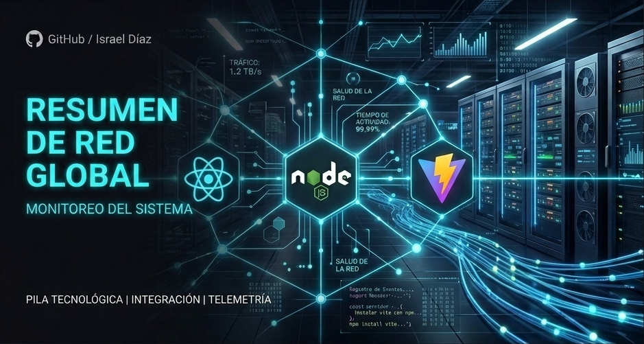

  

# ☕ Support

Si alguno de mis proyectos te resulta útil, considera dejar una ⭐ en el repositorio.

### *"AUTOMATIZACIONES WEB Y SISTEMAS DE GESTION"*

# 🐍 Contribution Snake

# 📊 Perfil de Desarrollo

| Área | Nivel |
|------|:-----:|
| 💻 Frontend | ██████████ |
| ⚙️ Backend | ██████████ |
| 🗄️ Bases de datos | █████████░ |
| ☁️ Cloud | ████████░░ |
| 📱 PWA | ██████████ |
| 🤖 IA aplicada | █████████░ |
| 🔒 Seguridad | ████████░░ |
| 🚀 DevOps | ███████░░░ |
| 🧠 Arquitectura | ████████░░ |

### ⭐ If you like my work, consider following me and starring my repositories!

